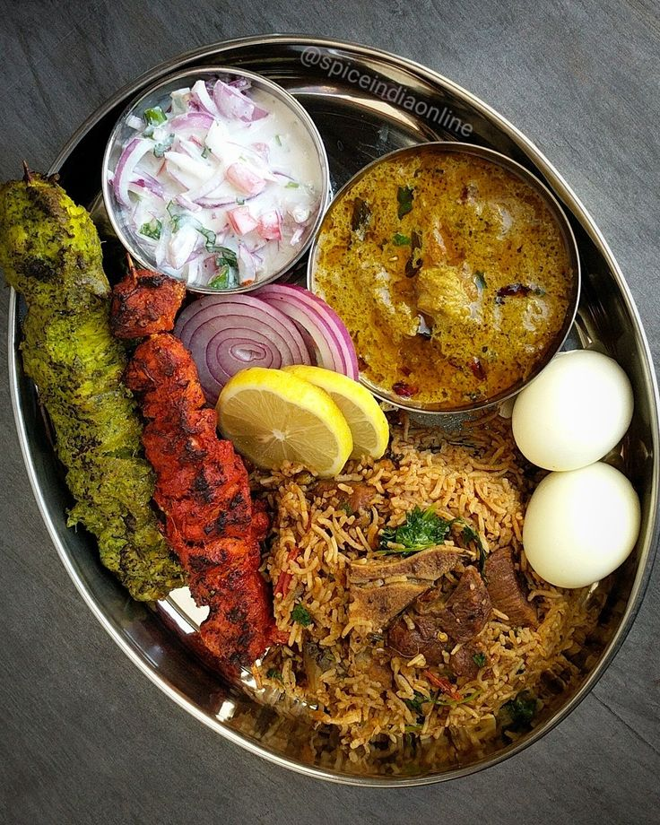

# NutriScan App
 
|  |  |

**Overview:**

- NutriScan is a user-friendly nutritional analysis app designed for individuals, including college students, to make informed dietary choices.
- The app utilizes advanced image recognition technology to analyze food items, providing detailed nutritional information for each item.

**Key Features:**

- **Image Recognition:**
  - Upload images of food items, and NutriScan will identify and analyze them using advanced image recognition algorithms.

- **Detailed Nutritional Analysis:**
  - Receive a comprehensive breakdown of nutritional components, including calories, proteins, carbohydrates, fibers, and fats for each food item.

- **Daily Intake Recommendations:**
  - The app offers daily macronutrient intake recommendations based on general guidelines, taking into account calories, proteins, carbohydrates, and fats.

- **User-Friendly Interface:**
  - An intuitive and user-friendly interface makes it easy for users to understand and interpret nutritional information.

**How to Use:**

1. **Upload Image:**
   - Simply upload an image of the food item you want to analyze.

2. **View Nutritional Details:**
   - NutriScan will generate a detailed table presenting the nutritional content of the food item, helping users make informed dietary choices.

3. **Daily Intake Guidelines:**
   - Get an overview of your daily macronutrient intake recommendations based on standard guidelines.

**Installation:**

- Clone this repository.
- Install the required dependencies using the provided `requirements.txt` file.
- Run the app locally or deploy it on a web server for public access.

**Dependencies:**

- [List of dependencies]

**Contribute:**

- Contributions to the development of NutriScan are welcome!
- Feel free to fork the repository, make improvements, and submit pull requests.

**License:**

- This app is licensed under [License Name].
- See the [LICENSE](LICENSE) file for details.
